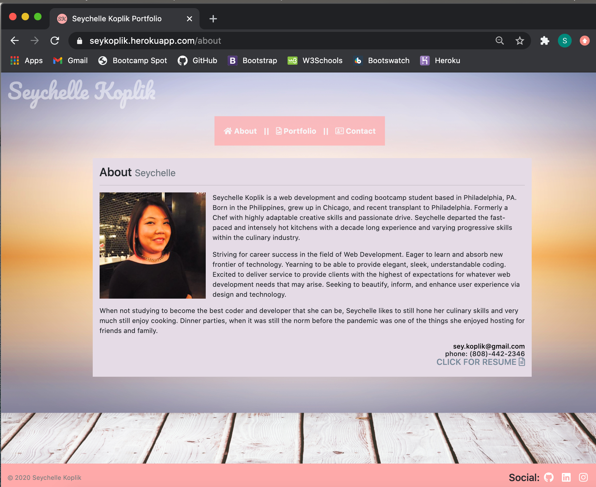
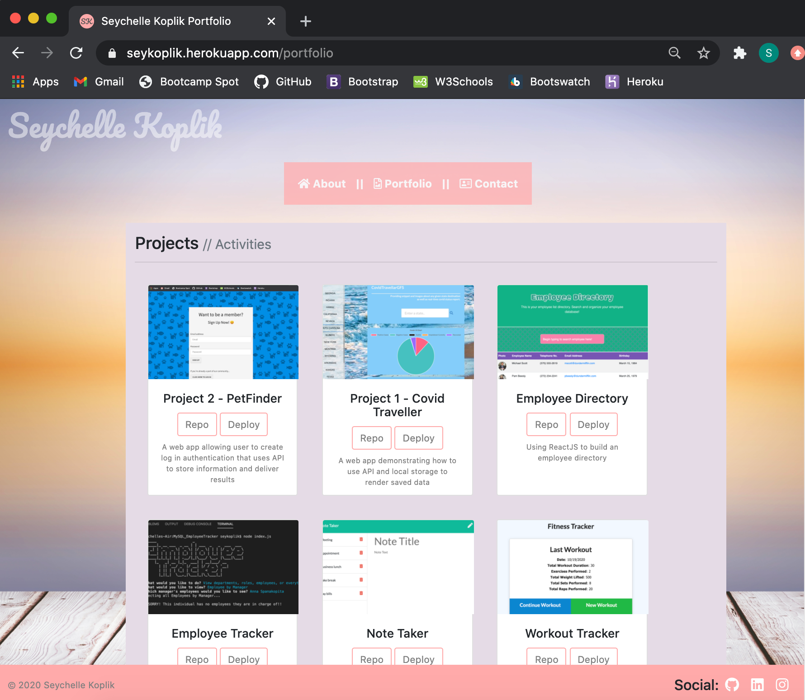
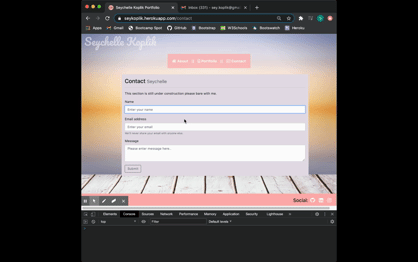

# ReactJS -- Portfolio Update

[](https://opensource.org/licenses/MIT)

## Description

An update to the portfolio using React. Creating a portfolio using React will help set you apart from other developers whose portfolios do not use some of the latest technologies.

Navigation with React Router, dynamic rendering, or another third part router. Building components that appears on multiple pages. Featuring pinned projects from GitHub profile

## Screenshot Previews







## Installation

Establish the starter files for the folder structure of your react app
```shell
npx create-react-app reactportfolio
```

Edit the folder structure to only include what is necessary for the app.

```shell
npm install --save
```
All the dependencies needed to build the app. See attributes for the dependincies used in this porfolio building

```shell
npm start
```
To view build 

Deploy to GitHub pages or Heroku to be able to utilized contact form for emailing capabilities.

## Usage
- User can view different sections of the portfolio (About, Profile, Contact)
- User can view all portfolio project with button to navigate to different repositories and deployed versions of each project
- User can click on contact and fill in a message me and I will receive message in my email

## Attributes
* NodeJS
* Nodemon
* Axios
* Dotenv
* ExpressJS
* Nodemailer
* ReactJS
* React-Dom
* React-Router-Dom
* Bootsrap
* Fontawesome
* GoogleFonts
* Favicon

## License

MIT License - https://opensource.org/licenses/MIT

## Links

HEROKU LINK: https://seykoplik.herokuapp.com/


---

&copy; 2020 Seychelle Koplik